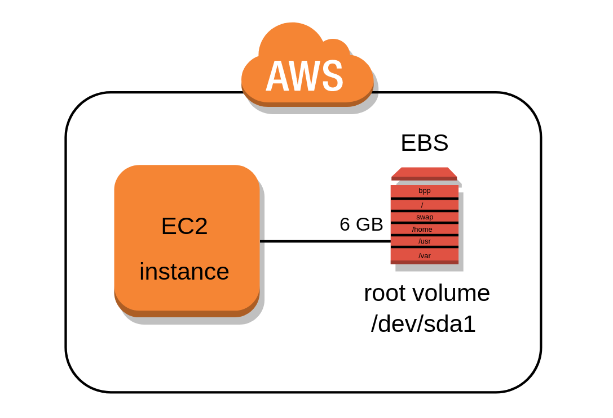

# Amazon Elastic Block Store (Amazon EBS)

Amazon Elastic Block Store (Amazon EBS) provides scalable, high-performance block storage resources that can be used with Amazon Elastic Compute Cloud (Amazon EC2) instances. With Amazon Elastic Block Store, you can create and manage the following block storage resources:

- Amazon `EBS volumes` — These are storage volumes that you attach to Amazon `EC2` instances. After you attach a volume to an instance, you can use it in the same way you would use a local hard drive attached to a computer, for example to store files or to install applications.

- Amazon `EBS snapshots` — These are `point-in-time` backups of Amazon EBS volumes that persist independently from the volume itself. You can create snapshots to back up the data on your Amazon EBS volumes. You can then restore new volumes from those snapshots at any time.